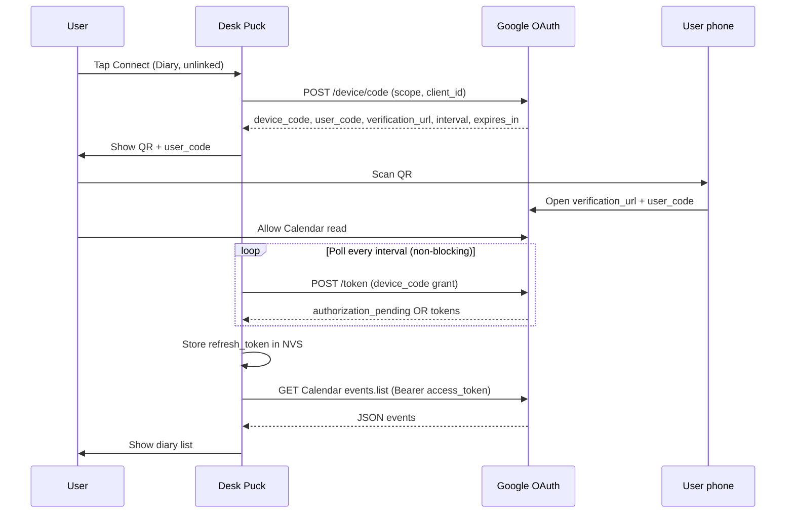

# Connect Google Calendar (device OAuth + QR)

**Status:** chosen approach for Diary v1.

The puck **cannot** sign in to Google with a password or by embedding an account email alone. The user links Calendar **once on the phone** via Google’s **OAuth 2.0 device authorization** flow; the puck shows a **QR code** on the round display. After approval, the puck stores a **refresh token** in NVS and syncs silently until access is revoked or cleared.

Calendar fetch, caching, and timezone rules live in [google-calendar.md](google-calendar.md). Product gestures and diary list UX are in [README.md](README.md).

---

## Decision

| Choice | Rationale |
|--------|-----------|
| **Device authorization grant** ([Google: limited-input devices](https://developers.google.com/identity/protocols/oauth2/limited-input-device)) | Standard pattern for ESP32-class gadgets; no browser on 240×240 |
| **QR on puck** | Avoid typing `user_code` on a round panel; scan opens verification on phone |
| **Refresh token in NVS** | No phone interaction for daily sync; only re-link when token invalid |
| **Not in v1:** companion CLI-only provisioning, home relay, service account | Keeps all linking UX on-device; relay remains a future ADR if needed |

**Out of scope:** encoding the user’s Gmail in firmware does **not** trigger auth. Optional `login_hint` may be added later in the verification URL only; it is not required for v1.

---

## User experience (product)

### Preconditions

- Puck has **WiFi STA** configured and connected (separate setup flow—captive portal, NVS, or build-time dev credentials; see [Implementation prerequisites](#implementation-prerequisites)).
- User opens **Diary** from the app shell.

### States the user sees

| State | Screen | User action |
|-------|--------|-------------|
| **Unlinked** | “Connect Google Calendar?” + short subtitle (read-only access) | **Tap** = start linking; long-press or secondary gesture TBD = skip (stay offline) |
| **Linking — QR** | QR (~120–160 px in safe circle) + human-readable `user_code` under QR + “Scan with phone” | Scan QR; approve on phone |
| **Linking — waiting** | Same QR or spinner + “Waiting for Google…” | Wait (poll on puck); optional **Cancel** tap |
| **Linked — sync** | Normal diary list (or loading bar first fetch) | Swipe up/down scroll |
| **Linked — error** | List from cache if any + “Can’t reach Google” / “Link expired” | Tap to **Reconnect** → Unlinked / QR flow |
| **Revoked / wiped** | Unlinked | Tap → QR again |

### Phone side (Google)

1. Camera or browser opens Google’s verification page (from QR).
2. User signs in if needed (often already signed in).
3. Consent screen names the **OAuth app** (e.g. “Desk Puck”) and **Calendar read-only** scope.
4. User taps **Allow**.
5. Phone shows success; puck transitions to **Linked** without further input.

No password is entered **on the puck**. Password on phone only if the Google session expired.

### After first link

- Diary loads **today** from Google when cache is stale.
- **No QR** on each boot unless refresh token is missing or Google returns `invalid_grant`.
- User can revoke access anytime in [Google Account → Third-party access](https://myaccount.google.com/permissions); puck returns to **Link expired** on next sync.

---

## End-to-end sequence



---

## OAuth protocol (implementation reference)

Base: [OAuth 2.0 for TV and limited-input device applications](https://developers.google.com/identity/protocols/oauth2/limited-input-device).

### 1. Start device authorization

```http
POST https://oauth2.googleapis.com/device/code
Content-Type: application/x-www-form-urlencoded
```

| Body field | Value |
|------------|--------|
| `client_id` | OAuth client ID (see [Google Cloud setup](#google-cloud-setup)) |
| `scope` | `https://www.googleapis.com/auth/calendar.readonly` (or `calendar.events.readonly`) |

**Response (JSON):** `device_code`, `user_code`, `verification_url`, `expires_in` (seconds), `interval` (minimum poll seconds, often 5).

Firmware must store `device_code`, `expires_in` start time, and `interval` in RAM for the linking session only—never log `device_code`.

### 2. QR payload

Encode a URL the phone can open without manual entry:

**Preferred (v1):** `{verification_url}?user_code={user_code}`

- `verification_url` is typically `https://www.google.com/device`.
- `user_code` format is human-friendly (e.g. `ABCD-EFGH`); URL-encode if needed.

**Display:**

- QR module: e.g. `ricmoo/QRCode` or LovyanGFX-friendly generator—evaluate size vs heap at impl time.
- Draw QR centred in safe area; show `user_code` in text below for manual entry fallback.
- Round clip: keep QR inside ~radius 90 px if readability suffers at full width.

### 3. Poll for token

```http
POST https://oauth2.googleapis.com/token
Content-Type: application/x-www-form-urlencoded
```

| Body field | Value |
|------------|--------|
| `client_id` | Same as above |
| `client_secret` | Required if OAuth client type uses a secret (see Cloud setup) |
| `device_code` | From step 1 |
| `grant_type` | `urn:ietf:params:oauth:grant-type:device_code` |

**Poll rules:**

- First poll after `interval` seconds; do not poll faster than Google’s `interval`.
- Step from `DiaryFeature::onTick` or `gcal_auth_poll()`—**never block** `loop()`.
- Stop polling when `expires_in` elapsed → UI **Link expired, tap to retry**.

| `error` (JSON) | Action |
|----------------|--------|
| `authorization_pending` | Continue polling |
| `slow_down` | Increase poll interval (+5 s) |
| `access_denied` | User denied; show message, return Unlinked |
| `expired_token` | QR session expired; offer new QR |
| (success) | Parse `access_token`, `expires_in`, `refresh_token` (if present), `token_type` |

Persist **`refresh_token`** when Google returns it (first consent). If no refresh token, treat link as failed and show setup hint (usually fixed by using correct client type and `prompt=consent` only on re-link flows—device flow docs note refresh on first approval).

### 4. Ongoing access (after link)

```http
POST https://oauth2.googleapis.com/token
Content-Type: application/x-www-form-urlencoded

grant_type=refresh_token&client_id=...&client_secret=...&refresh_token=...
```

Store `access_token` in RAM only; refresh when sync returns 401 or token age &gt; ~50 min.

---

## Firmware modules

| Module | Path (planned) | Role |
|--------|----------------|------|
| WiFi STA | `src/wifi/wifi_station.cpp` | Connect, reconnect, `WiFi.status()` |
| Google auth | `src/diary/gcal_auth.cpp`, `include/diary/gcal_auth.h` | Device flow + refresh; NVS read/write |
| Calendar sync | `src/diary/diary_sync.cpp` | `events.list`, parse → `DiaryDay` |
| Day cache | `src/diary/diary_cache.cpp` | NVS blob for last good day |
| QR draw | `src/diary/diary_qr.cpp` or inline in feature | Build QR matrix → LovyanGFX bitmap |
| UI | `src/diary/diary_feature.cpp` | Screens by `GcalLinkState` + list scroll |

### `GcalLinkState` (auth FSM)

```
NotConfigured   → no refresh token in NVS
PromptConnect   → user sees “Connect?”
DeviceCodePending → POST /device/code in flight
ShowQr          → displaying QR, polling not started or active
PollingToken    → polling /token
Linked          → refresh token valid (may still be fetching events)
LinkFailed      → transient error, retry allowed
NeedsReauth     → invalid_grant / revoked
```

Transitions:

- `NotConfigured` → `PromptConnect` on Diary enter (or global first-run).
- `PromptConnect` + **Tap** → `DeviceCodePending` (requires WiFi up; else show “WiFi needed”).
- Success `/device/code` → `ShowQr` + start poll timer → `PollingToken`.
- Poll success + NVS write → `Linked` → trigger `diary_sync_request()`.
- `invalid_grant` on refresh → `NeedsReauth` → `PromptConnect` after user acknowledges.

### NVS namespace `gcal` (proposed)

| Key | Type | Content |
|-----|------|---------|
| `refresh` | string | OAuth refresh token |
| `linked` | u8 | 1 if ever linked successfully |
| `cal_id` | string | default `primary` |
| `tz` | string | IANA timezone last used for `timeMin`/`timeMax` |

Secrets **must not** appear in serial logs when `DEBUG_*` is off. Dev builds may log link state enum only.

### OAuth client credentials in firmware

| Item | Storage |
|------|---------|
| `client_id` | `secrets.h` (gitignored from template) or Kconfig-style `include/gcal_config.h.example` |
| `client_secret` | Same, if client type requires it |

Document in repo: copy `gcal_config.h.example` → `gcal_config.h` for local builds. CI uses test doubles or skips live Google tests.

---

## Google Cloud setup

1. [Google Cloud Console](https://console.cloud.google.com/) → new or existing project.
2. **APIs & Services → Enable APIs** → **Google Calendar API**.
3. **OAuth consent screen**
   - User type: External (personal Gmail) or Internal (Workspace).
   - App name: **Desk Puck** (shown on phone).
   - Scopes: add `.../auth/calendar.readonly`.
   - **Test users:** add your Gmail while publishing status is **Testing**.
4. **Credentials → Create OAuth client ID**
   - Application type: **TVs and Limited Input devices** (device flow).
   - Note **Client ID** and **Client secret** (if shown) for `gcal_config.h`.
5. Production use may require [OAuth verification](https://support.google.com/cloud/answer/9110914); Testing mode is enough for personal pucks.

---

## Implementation prerequisites

Before QR linking works in firmware:

| Prerequisite | Notes |
|--------------|--------|
| WiFi credentials in NVS | Minimal STA module; Diary “Connect” disabled or shows “Set up WiFi” until associated |
| SNTP + timezone | Required for correct “today” window before first sync ([google-calendar.md](google-calendar.md)) |
| TLS + CA bundle | `WiFiClientSecure` for `oauth2.googleapis.com` and `www.googleapis.com` |
| Heap budget | Log free heap after QR render + one HTTPS POST; target ≥80 KB free |

WiFi setup UX is **not** part of this doc; it can be a shared `src/wifi/` feature used by Diary and future net features.

---

## Error and edge cases

| Condition | UX |
|-----------|-----|
| WiFi down at Connect | “WiFi required” + retry |
| `/device/code` HTTP error | “Couldn’t reach Google” + retry |
| User denies on phone | “Access denied” → PromptConnect |
| QR expires (`expires_in`) | “Code expired” → new tap generates new QR |
| User leaves Diary during poll | Continue poll in background **or** cancel poll on exit (impl choice: **continue** if &lt;2 min left, else cancel to save power—document in code comment) |
| Token OK, Calendar 403 | Scope or API not enabled—serial error, “Setup error” |
| Revoked token | NeedsReauth + Connect again |

---

## Security

- Read-only Calendar scope only.
- Refresh token in NVS; optional flash encryption later.
- No passwords, no user email required in firmware for v1.
- QR exposes a **time-limited** `user_code`; not a long-lived secret.
- Ship `gcal_config.h.example` without real credentials.

---

## Acceptance criteria (v1 link + sync)

1. Unlinked Diary shows **Connect Google Calendar?**; tap starts flow.
2. Puck displays scannable QR; phone consent completes link within `expires_in`.
3. Refresh token persisted; reboot does not show QR again.
4. Diary shows real **primary** calendar events for local today after sync.
5. Revoke in Google Account → puck shows re-link on next refresh attempt.
6. Entire OAuth poll runs without blocking touch or shell navigation &gt;100 ms per `loop()` iteration.

---

## Implementation plan (task breakdown)

Use this as the backlog for firmware work. Order respects dependencies.

### Phase A — WiFi + time

- [ ] `wifi_station_begin()` / `wifi_station_poll()` — NVS SSID/password, reconnect backoff
- [ ] SNTP sync; store IANA `TZ` in NVS (or detect from calendar metadata on first sync)
- [ ] `main.cpp` or shell: call `wifi_station_poll()` each loop

### Phase B — Auth core

- [ ] `gcal_config.h.example` + gitignore real config
- [ ] `gcal_auth_start_device_flow()` — POST `/device/code`, populate QR URL string
- [ ] `gcal_auth_poll()` — non-blocking token poll state machine
- [ ] `gcal_auth_save_refresh()` / `gcal_auth_has_refresh()` / `gcal_auth_clear()`
- [ ] `gcal_auth_get_access_token()` — refresh if expired (RAM cache of access token + expiry)

### Phase C — QR + Diary UI

- [ ] QR render helper (fixed buffer, measure heap)
- [ ] Diary screens: Unlinked, QR+wait, Linked list, error banner
- [ ] Tap handlers: Connect, Cancel (optional), Reconnect
- [ ] Remove placeholder events when `Linked` and cache/sync available

### Phase D — Calendar sync (depends on B)

- [ ] `diary_sync_fetch_today()` — `events.list` per [google-calendar.md](google-calendar.md)
- [ ] Parse into `DiaryDay`; `diary_cache` NVS write/read
- [ ] Wire `onEnter` / `onTick` refresh policy

### Phase E — Verification

- [ ] Manual test: link via QR, reboot, see events
- [ ] Manual test: revoke, see NeedsReauth
- [ ] Document operator steps in [bringup.md](../../bringup.md) (WiFi + Google Cloud + first link)

---

## References

- [OAuth 2.0 for TV and limited-input devices](https://developers.google.com/identity/protocols/oauth2/limited-input-device)
- [RFC 8628 — OAuth 2.0 Device Authorization Grant](https://datatracker.ietf.org/doc/html/rfc8628)
- [Calendar API events.list](https://developers.google.com/calendar/api/v3/reference/events/list)
